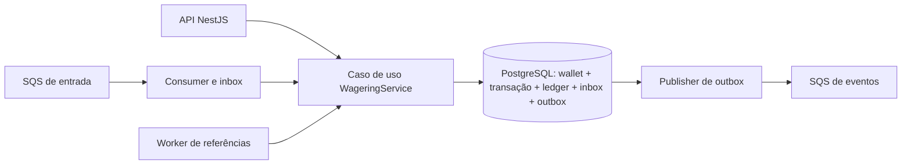

# Decisões de arquitetura

## Fluxo e responsabilidades



O domínio contém classes com construtores privados, factories e transições explícitas; não importa NestJS nem MikroORM. As entradas HTTP e SQS chamam `submit`. As adapters ficam em `infrastructure` e `http`. `WageringService` coordena a transação e concentra a persistência; separar repositories em portas menores seria uma evolução para uma base maior. A opção atual reduz abstrações e permite revisar a atomicidade num único lugar.

## Dinheiro e ORM

`Money` é imutável, usa bigint em centavos e nunca converte dinheiro para `number`. Exemplo: `0.10 + 0.20` soma `10n + 20n`, serializando `0.30`. Não há arredondamento silencioso: entradas com escala diferente de dois são rejeitadas. Valores negativos só existem em cálculos internos, como diferença de reconciliação; contratos de entrada os rejeitam.

O limite é 16 dígitos inteiros, compatível com `numeric(18,2)`. Moedas de entrada aceitas: BRL, USD, EUR. O domínio preserva a moeda e rejeita operações entre moedas diferentes. A lista de contratos pode ser ampliada sem alterar a aritmética; a implementação assume duas casas para todas as moedas suportadas.

MikroORM 6 usa `EntitySchema` explícito para `WalletRecord`, separando modelo de persistência e agregado. `balance` é mapeado como string com coluna `numeric(18,2)`, sendo reidratado como `Money`. Na abertura usamos `em.create/persist/flush`; operações concorrentes usam SQL parametrizado via `EntityManager.execute`, dentro de `em.fork().transactional()`. Isso torna `ON CONFLICT`, locks e queries de workers explícitos. Não há estado compartilhado no Identity Map entre requisições e não há UoW com wallet desatualizada durante updates nativos. As demais tabelas são acessadas por SQL; o projeto não pretende ocultar constraints específicas de PostgreSQL atrás de repositories genéricos.

## Concorrência e idempotência

A ordem é lock da wallet, inbox (quando necessário), inserção da identidade da transação, efeito financeiro. `SELECT ... FOR UPDATE` serializa apenas operações da mesma wallet. Wallets diferentes usam locks distintos e podem avançar em paralelo. Cada transação usa uma conexão e a mesma transação SQL para todas as escritas. Timeout de lock de cinco segundos; deadlocks, serialization failures e lock timeouts têm até duas novas tentativas locais. Depois, HTTP retorna 503 e SQS tenta novamente. Não há mutex em memória nem dependência de FIFO para correção.

Duas apostas de 80 com saldo 100: a primeira observa 100, debita, grava ledger e confirma; a segunda adquire o lock e observa 20, gravando rejeição terminal. A constraint de saldo é uma segunda proteção.

`idempotency_key` tem UNIQUE global; `(provider_id, external_transaction_id)` também tem UNIQUE. A chave recebida é a fonte da verdade e não é substituída por uma chave derivada. Os clientes são orientados a usar `providerId:externalTransactionId`.

O hash é SHA-256 de JSON canônico do input validado: campos de negócio, chaves recursivamente ordenadas, UUIDs normalizados em minúsculas e Money com duas casas. Header, idempotencyKey de transporte, occurredAt e messageId ficam fora desse hash. Fields desconhecidos são ignorados pelo parser e não influenciam a operação. A inbox tem um hash separado de `{input,key}`, para detectar mudanças na chave associada ao mesmo envelope.

`INSERT ... ON CONFLICT DO NOTHING` resolve races de identidade; em conflito, recuperamos os registros por chave e identidade externa. Só é replay quando há exatamente um registro com mesma chave e hash. Reutilizar ID externo com outra chave é conflito. O resultado persistido inclui o saldo observado na aplicação, permitindo replay após outras movimentações. Não consultamos o saldo atual para reconstruir resposta terminal. A inbox consulta o resultado atual da transação em replay, para que uma referência antes pendente possa aparecer como resolvida.

## Schema e ledger

O banco aplica:

- wallet única por player e moeda; saldo não negativo; versão inicia em 1 e incrementa exatamente quando saldo muda; identidade imutável;
- identidade de transações única e valores não negativos; NaN explicitamente bloqueado em todas as colunas monetárias;
- no máximo um ledger por transação e wallet;
- FKs compostas preservando wallet e moeda do ledger;
- fórmula `balanceBefore ± amount = balanceAfter` e saldos não negativos;
- índice parcial único `(reference_transaction_id, kind)` para reversões processadas;
- trigger bloqueando UPDATE, DELETE e TRUNCATE do ledger;
- trigger bloqueando mudanças de transações terminais e de campos de identidade; DELETE/TRUNCATE de transações são bloqueados;
- constraints deferred conferindo, no commit, saldo contra soma do ledger e exatamente um lançamento correspondente para uma operação financeira processada;
- identidade e payload de eventos da outbox imutáveis; tentativas e publicação podem mudar.

A abertura positiva grava OPENING e crédito na mesma transação da wallet; saldo zero não gera transação financeira. A versão começa em 1; muda apenas com saldo. LOSS e rejeições não incrementam a versão nem geram ledger. A aplicação calcula entradas a partir do agregado bloqueado. As constraints deferred conferem o estado final depois de todas as escritas.

Conferir a soma do ledger em cada commit tem custo proporcional ao histórico da wallet. É uma escolha conservadora para o desafio: fortalece a garantia no schema e facilita a auditoria, mas uma wallet muito movimentada precisaria de uma estratégia incremental validada no banco. Não é apresentado como solução de alta escala. O usuário local é dono do schema para facilitar migrations; em produção separam-se role de migrations e role de aplicação e restringem-se privilégios.

## Transações e referências

Transições válidas:

```text
PENDING -> PROCESSED | REJECTED | FAILED | PENDING_REFERENCE
PENDING_REFERENCE -> PENDING_REFERENCE | PROCESSED | REJECTED | FAILED
PROCESSED, REJECTED, FAILED -> nenhuma
```

O worker reidrata um candidato pendente para uma nova tentativa; não altera a identidade nem modifica estados terminais. Erros de programação em transições terminais lançam erro; não são tratados como replay.

BET debita; WIN credita; LOSS registra resultado sem saldo e exige `0.00`. WIN e LOSS podem opcionalmente referenciar BET, aplicando as mesmas validações de contexto. Não impomos unicidade de resultado por rodada: o desafio especifica identidade por operação e reversão por tipo. REFUND só reverte BET; ROLLBACK reverte BET, WIN ou REFUND. A reversão deve ser integral, da mesma wallet/player/provider/moeda/rodada, com referência processada. Reversão de crédito pode falhar por saldo insuficiente, com código distinto.

A unicidade é por referência **e tipo**, conforme enunciado: um REFUND e um ROLLBACK diferentes podem referenciar a mesma BET uma vez cada. Uma regra de exclusão entre esses tipos dependeria de contrato adicional com o provedor. ROLLBACK de ROLLBACK não é permitido.

Referência inexistente ou ainda pendente deixa a operação como PENDING_REFERENCE. Um evento de pendência é emitido na primeira aceitação; retries não o repetem. Referência já rejeitada ou failed gera REFERENCE_NOT_PROCESSED. O worker busca vencidas, bloqueia a wallet com SKIP LOCKED, relê o estado e o prazo antes de tentar. Backoff 1, 2, 4, 8, 16, 32, 60 segundos; máximo de dez tentativas ou TTL de cinco minutos, ajustáveis por ambiente. Ao esgotar, REFERENCE_EXPIRED e evento de rejeição. O limite evita pendências infinitas; deve ser ajustado aos atrasos reais de provedores.

FAILED existe como estado terminal do modelo e do schema para erro permanente de infraestrutura já identificado e auditável. Não marcamos uma transação como FAILED diante de perda de conexão, pois o estado do commit pode ser desconhecido. O retry com mesma identidade é o caminho seguro. Erros permanentes de envelope vão para DLQ e não criam uma transação financeira fictícia.

## Inbox, ack e falhas

SQS FIFO é otimização de agrupamento, não garantia financeira. Inbox UNIQUE `(consumer_name,message_id)` e idempotência da operação são garantias independentes: mesmo envelope repetido e envelopes diferentes para mesma operação são seguros.

Inbox, estado financeiro, ledger e outbox participam da mesma transação SQL. `DeleteMessage` ocorre depois de `submit` retornar, portanto depois do commit. Se o processo morrer nesse intervalo, outra instância recebe novamente e recupera o resultado sem mover saldo. Pendências e rejeições financeiras são resultados duráveis e recebem ack. Falhas transitórias, inclusive wallet ainda inexistente, liberam a mensagem com backoff exponencial. Envelope inválido ou identidade conflitante vai para DLQ; erro transitório repetido tem limite de cinco recebimentos, com redrive do broker como proteção adicional.

Heartbeat renova visibility timeout a cada dez segundos durante processamento. Em SIGTERM não se inicia um novo trabalho; recebimentos que acabaram de chegar têm visibilidade devolvida e trabalhos ativos terminam antes de fechar banco e SQS. Falha ao enviar para DLQ não apaga a mensagem original. Falha no ack pode gerar redelivery e permanece segura.

## Transactional outbox

Os eventos são criados dentro da transação financeira e publicados por outro worker. Publishers reivindicam uma linha com `FOR UPDATE SKIP LOCKED`, enviam para SQS e marcam published_at. O lock é mantido durante o envio: solução simples, com latência externa ocupando conexão, porém sem lease que possa expirar prematuramente. Falhas de envio incrementam attempts e próximo prazo, com backoff até 60s, sem limite que descarte eventos confirmados.

Se o publisher morrer após envio e antes de marcar publicação, o evento será reenviado com mesmo eventId. A entrega é at-least-once; consumidores de integração devem deduplicar eventId de forma persistente. O dedup de SQS FIFO reduz duplicatas dentro de sua janela, mas não é a prova de correção. Publishers concorrentes podem publicar eventos de uma wallet fora da ordem de criação; `walletVersion` permite ao consumidor detectar versões antigas. Não prometemos ordenação de eventos, apenas durabilidade e identidade estável.

Eventos tipados: WagerTransactionProcessed (inclui LOSS), WagerTransactionRejected, WalletBalanceChanged e WagerTransactionPendingReference. São subclasses concretas de IntegrationEvent, com versão 1. MoneyProps é serializado no payload; objetos Money não são gravados como eventos.

## HTTP e códigos de falha

Validação de contrato usa 400; não encontrado, 404; conflito, 409; rejeição financeira auditada, 422; pendência, 202; processada, 200; infraestrutura transitória conhecida, 503; erro interno inesperado, 500. A classificação verifica códigos estruturados de conexão, timeout, concorrência e indisponibilidade, inclusive em causas encapsuladas; não interpreta textos de mensagens. Replay preserva o mesmo resultado e status HTTP, com idempotentReplay=true. Consultas retornam o estado como recurso (200), incluindo rejeições.

| Código                                                            | Interpretação                                              |
| ----------------------------------------------------------------- | ---------------------------------------------------------- |
| INVALID_PAYLOAD, INVALID_ENVELOPE, INVALID_KIND                   | Corrigir contrato; OPENING não é aceito externamente       |
| INVALID_AMOUNT, AMOUNT_MUST_BE_POSITIVE, LOSS_AMOUNT_MUST_BE_ZERO | Corrigir valor/escala                                      |
| INVALID_CURRENCY, UNSUPPORTED_CURRENCY                            | Corrigir moeda                                             |
| REFERENCE_REQUIRED                                                | Informar referência                                        |
| IDEMPOTENCY_CONFLICT, INBOX_PAYLOAD_CONFLICT                      | Identidade reutilizada com conteúdo divergente; investigar |
| WALLET_ALREADY_EXISTS                                             | Consultar wallet existente                                 |
| WALLET_NOT_FOUND, TRANSACTION_NOT_FOUND                           | Recurso ainda não existe                                   |
| INSUFFICIENT_FUNDS                                                | Aposta rejeitada por falta de saldo                        |
| REVERSAL_INSUFFICIENT_FUNDS                                       | Reversão de crédito causaria saldo negativo                |
| CURRENCY_MISMATCH, PLAYER_MISMATCH                                | Operação não corresponde à wallet                          |
| REFERENCE_CONTEXT_MISMATCH                                        | Referência pertence a outro contexto                       |
| INVALID_REFERENCE_KIND                                            | Tipo não reversível por esta operação                      |
| REFERENCE_NOT_PROCESSED                                           | Referência terminou sem aplicação financeira               |
| REFERENCE_AMOUNT_MISMATCH                                         | Valor da reversão difere da referência                     |
| ALREADY_REVERSED                                                  | Referência já revertida por este tipo                      |
| REFERENCE_EXPIRED                                                 | Referência não resolvida no limite; investigar             |
| BALANCE_LIMIT_EXCEEDED                                            | Crédito ultrapassa limite de armazenamento                 |
| TEMPORARY_UNAVAILABLE                                             | Retry usando mesma chave                                   |

Rejeições são terminais: corrigir payload exige uma nova identidade de operação, respeitando o contrato do provedor. A taxonomia não depende de texto da mensagem de erro.

## Autenticação

Foi deixada fora do timebox, conforme seção 2. `ProviderAuthGuard` é um ponto de extensão no-op aplicado apenas às rotas financeiras. Desenho proposto: Keycloak/Zitadel OIDC, JWT assinado, validação de issuer/audience/exp e claim de providerId confrontada com o payload. Health permanece público. Mensagens SQS são canal interno confiável, mas providerId e demais relações de domínio continuam validados. O provider `__internal__` é reservado a OPENING. Não há cadastro de senhas ou autenticação artesanal.

## Observabilidade e limitações

Logs JSON incluem contexto de submissão (correlationId, messageId quando existe, transactionId, walletId, providerId), status e código de erro, sem payloads ou saldos financeiros completos. Métricas Prometheus cobrem transições por status, duplicatas, retry, DLQ, conflitos de lock, idade da outbox, duração e divergências de reconciliação. A API expõe `/metrics`; cada worker expõe `/metrics` e health na porta interna 3001, que deve ser coletada por instância. Não somamos métricas de processos em memória compartilhada. DLQ redrive feito diretamente pelo broker exige também coleta nativa de métricas SQS em produção.

Reconciliação usa lock da wallet para comparar um snapshot consistente, retorna diferença, registra divergência e incrementa métrica. Não corrige saldo silenciosamente. Constraints impedem divergência por escrita normal, mas reconciliação também detecta corrupção administrativa/legada.

A readiness exige PostgreSQL e todas as filas alcançáveis. Liveness só mede processo. O projeto não inclui frontend, OIDC real, OpenTelemetry, dashboard, double-entry ou teste de carga. Credenciais e valores de Compose são exclusivamente para desenvolvimento local. Essas opções não competem com as garantias financeiras no prazo de três dias.

## Evidência de testes

`bun run test` valida Money, Wallet, ledger, transições, regras e hash. `bun run test:integration` usa PostgreSQL/LocalStack reais, HTTP real, múltiplos processos Bun e failpoints habilitados somente em NODE_ENV=test. O teste de crash mata o processo com SIGKILL depois do commit e antes do ack. Outro mata o publisher depois do envio e antes da marcação. Todas as carteiras financeiras usadas nos testes são reconciliadas ao final. Migrations up/down/up são exercitadas em banco descartável separado.

O README descreve como reproduzir. A suíte cria seu próprio banco descartável e prefixo de filas, isolando os testes de workers da aplicação. Esses recursos temporários são removidos ao final.
